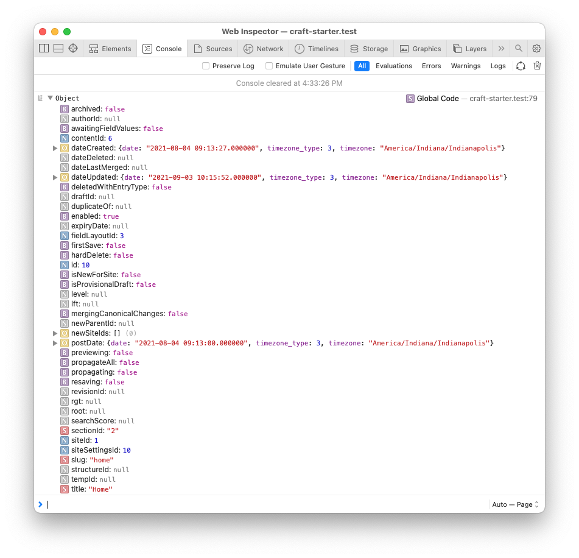

# 🐞 Debug
A simple Craft module to debug Twig within your browser



## Usage

```twig
{# Send the contents of `var` to a console.log() #}
{{ debug(var) }}

{# Send the contents of `var` to a console.table() #}
{{ debug(var, { view: 'table' }) }}

{# Send the contents of `var` to an instance of Symfony's VarDumper component #}
{{ debug(var, { view: 'inline' }) }}
```

**NOTE**: If [devMode](https://craftcms.com/docs/3.x/config/config-settings.html#devmode) is disabled the debug statement will not be processed.

## Installation
1. [Download a zip archive](https://github.com/trendyminds/craft-debug/archive/master.zip), rename folder to `debug` and add it to your `modules/` folder.
2. Add the contents of the `app.php` file to your `config/app.php` (or just copy it there if it does not exist)
```php
return [
	'modules' => [
		'debug' => \modules\debug\Debug::class,
	],
	'bootstrap' => [
		'debug',
	],
];
```
3. Add the following to your project's `composer.json` file so that Composer can find your module:
```json
"autoload": {
  "psr-4": {
    "modules\\debug\\": "modules/debug/"
  }
},
```

4. Run the following in your command line
```sh
composer dump-autoload
```
